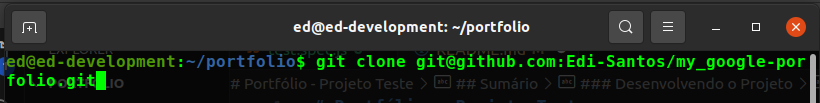

# Portfólio - Projeto Teste

Este será um _projeto teste_ para entendermos a ideia, como será o desenvolvimento dos projetos futuros, e tudo mais.

> _Obs._: Leia com bastante atenção todo o **README** antes de começar a desenvolver, pois nele estão contidas todas as informações necessárias para desenvolver o projeto sem grandes problemas.

---

## Sumário

  - [Requisitos Para Desenvolvimento do Projeto](#requisitos-para-desenvolvimento-do-projeto)
  - [Sobre o Projeto](#sobre-o-projeto)
    - [Tecnologias a serem utilizadas](#tecnologias-a-serem-utilizadas)
  - [Desenvolvendo o Projeto](#desenvolvendo-o-projeto)
    - [Clonando o Projeto](#clonando-o-projeto)
    - [Iniciando o Projeto](#iniciando-o-projeto)
  - [Durante o Desenvolvimento](#durante-o-desenvolvimento)
    - [Rodando os Testes](#rodando-os-testes)
  - [Requisitos do Projeto](#requisitos-do-projeto)
    - [Lista de Requisitos](#lista-de-requisitos)
      - [1 -Crie un `<header/>`](#1---crie-um-header)
      - [2 - Crie um `<body/>`](#2---crie-um-body)
      - [3 - Crie um `<footer/>`](#3---crie-um-footer)
  - [Considerações Finais](#considerações-finais)

---

### Requisitos Para Desenvolvimento do Projeto

Para este projeto será necessário que você tenha instalado em sua máquina:

- VS Code (_sugestão_)
- NodeJS _v18.17.0^_ (versão LTS)

> _Obs._: O _VS Code_ é a sugestão, pois ele oferece muitos recursos que nos auxilia muito na hora do desenvolvimento de um projeto. Além de que este é um dos _editores de código/IDEs_ mais utilizado no mercado.

Para verificar a versão do _Node_ instalada em sua máquina, abra o terminal e digite o comando:

```
node --version
```

Caso você tenha uma versão mais antiga do _Node_ instalada em sua máquina será necessário que você atualize para a versão _LTS (v18.17.0)_ para evitar possíveis erros na hora de rodar os testes. <br>
Você pode usar o `NVM` para gerenciar diferentes versões do _Node_ em sua máquina. O _NVM_ é, apenas, uma ferramenta para gerenciamento de versões do _Node_

Você pode aprender mais sobre _**NVM**_ <a href='https://github.com/nvm-sh/nvm'>aqui</a>.

---

### Sobre o Projeto

A proposta deste projeto é criar um _portfólio_ simples utilizando, apenas, **HTML** e **CSS**. Futuramente nós faremos nosso porfólio utilizando **ReactJS**. <br>
Os testes cobrem somente o uso de _TAGs_ indispensáveis deixando-o, então, livre para que possa usar a sua criatividade no desenvolvimento. Há um exemplo simples para auxiliar no processo criativo ou, até mesmo, ser reproduzido. Sinta-se a vontade para estilizar a página à sua maneira.

#### Tecnologias a serem utilizadas
As tecnologias que serão utilizadas para desenvolver o projeto serão:

- **HTML5**
- **CSS3**

Se desejar fazer uso de alguma biblioteca como o _Bootstrap_, por exemplo, fique a vontade. :grin:

---

### Desenvolvendo o Projeto

#### Clonando o Projeto

Para começar a desenvolver você deve clonar o projeto para um repositório vazio em sua máquina, um repositório criado, especialmente, para o desenvolvimento do projeto.

Para clonar o projeto clique no botão `Code`:


Feito isto, copie o link do projeto:


>_Obs._: **Estas imagens são exemplos de outro repositório.**

Em seguida, abra o terminal no repositório dedicado ao projeto e dê um _git clone_ para baixar o projeto para sua máquina.



Concluído estes passos, você estará com o projeto baixado em sua máquina.

#### Iniciando o Projeto

>**:warning: PARA FAZER O PROJETO VOCÊ PRECISARÁ CRIAR UM ARQUIVO HTML COM O NOME `index.html`, POIS O _CYPRESS_ VAI BUSCAR POR ESTE ARQUIVO PARA EXECUTAR OS TESTES :warning:**

1. Entre na pasta que você acabou de clonar:

```
cd portfolio_projeto-teste
```

**:bangbang: :warning: ANTES DE FAZER QUALQUER ALTERAÇÃO!!! :warning: :bangbang:**

2. Crie uma branch

Antes de qualquer alteração no projeto, certifique-se de que você está na _branch master_:

```
git branch
```

Caso precise trocar de branch utilize o comando:

```
git checkout master
```

Em seguida, crie uma branch a partir da branch `master`.

> :warning: Como teremos muitas branches de diferentes usuários é bom que tenhamos um padrão de nomeação das branches para manter o mais organizado possível. :warning:

Para nomear sua branch coloque, primeiro o seu nome de usuário do GitHub e em seguida o nome do projeto como no exemplo a seguir:

```
git checkout -b edi-santos-portfolio
```

>_Obs._: O comando acima executa 3 ações: sai da branch; a partir da branch anterior, cria a nova branch; e entra na branch criada.

É nessa branch que você desenvolverá **TODO** o seu projeto submetendo seus `commits`, seguindo os requisitos e cumprindo os testes.

3. Instale as dependências do projeto

Com a sua branch criada a partir da _master_, instale as dependências do projeto usando o comando:

```
npm install
```

4. Faça o primeiro `commit`

Feito tudo isto, é hora de fazer o primeiro _commit_ para podermos abrir um _Pull Request_ e subir nossa branch para o repositŕoio remoto.

- Faça a primeira alteração criando um arquivo `HTML` com o nome: `index.html`;
- Verifique o status do Git: `git status`. Deve aparecer, em vermelho, o nome do arquivo criado e, possivelmente, outros arquivos que surgiram após a instalação das dependências;
- Adicione todas as alteração ao **stage** do Git de uma vez: `git add .`;
- Confira o status do Git novamente: `git status`. As alterações adicionadas ao _stage_, agora, aparecerão com o nome em verde;
- Em seguida, faça o commit das alterações adicionadas ao _stage_ com uma mensagem. Exemplo: `git commit -m 'iniciando o projeto :rocket:'`;

> _Obs1._: A _flag_ `-m` é que nos permite adicionar uma mensagem ao commit. Sempre utilize esta _flag_, pois faz parte das _boas práticas_ de desenvolvimento.

- Confira, novamente, o _stage_. Desta vez deve aparecer a mensagem `nothing to commit, working tree clean` ou algo do tipo;

- Faça o **push** de sua branch para o repositório remoto com as alterações commitadas: `git push -u origin edi-santos-portfolio`.

> _Obs2._: a flag `-u` torna esta uma branch padrão para o **push**. Desta forma você não precisará mais declarar o nome da branch remota e local. Você poderá utilizar apenas o comando `git push` daqui para frente.

5. Abra um _**Pull Request**_

Ao subir a sua _branch_ você verá uma mensagem, na página do repositório, soliticando que abra um **PR** (_Pull Request_). Aqui é preciso que você faça com _**BASTANTE ATENÇÂO**_.

- Clique no botão verde `New pull request`;
- Clique em `Compare` e escolha a sua _branch_ com atenção (geralmente a sua branch é selecionada por padrão, mas sempre confira antes);
- Clique no botão verde `Create pull request`;
- Adicione uma descrição ao seu _PR_ e clique no botão verde `Create pull request`;

> :warning: Nós manteremos um padrão nos nomes dos _PRs_ também que será o mesmo da branch, primerio o seu nome e em seguida o nome do projeto. Exemplo para nome de _PR_: <br>
> `[Edi Santos] - Portfolio`

- Daqui em diante você não precisa fazer mais nada em seu _PR_ além de subir seus commits

---

### Durante o Desenvolvimento

:warning: Faça _**commits**_ regularmente durante o processo de desenvolvimento do seu projeto. Isso faz parte das _boas práticas_ de desenvolvimento e ajuda a versionar seu projeto com muito mais precisão. :warning:

Busque fazer uso de `commits semânticos`. Você pode aprender mais sobre este tipo de _commit_ <a href="https://github.com/iuricode/padroes-de-commits">aqui</a>. <br>
_Commits semânticos_ também fazem parte das _boas práticas_.

#### Rodando os Testes

Os testes foram feitos com _Cypress_. O _Cypress_ acessa o código fonte pelo nome do arquivo (por isso a necessidade de nomear de acordo com o que foi pedido anteriormente) ou o link remoto.

Tendo as dependências do projeto já instaladas nós poderemos colocar o _Cypress_ para funcionar. <br>
Com o terminal na raiz do projeto, utilize o comando:

```
npm run cy:open
```

Aguarde um pouco, pois pode ser que demore um tempinho até abrir a tela de testes do _Cypress_

Em seguida abrirá a seguinte tela:


Nesta tela serão exibidos os arquivos que contém os testes. <br>

Abra o arquivo `test.spec.js`. A tela que abrirá será a seguinte:


Se você rodar o teste antes de começar a desenvolver o projeto você receberá a mensagem de erro mostrada acima dizendo que houve uma falha na tentativa de encontrar o arquivo `index.html` na raiz o do projeto (caminho `./`).

Ao começar a desenvolver seu projeto, conforme for evoluindo, você deve ir rodando os testes. Você verá que a cada teste passado será exibido um sinal de _check_ verde.


>:exclamation: _**DICA**_: Esteja atento às mensagens de erro, pois elas costumam ser muito certeiras e claras sobre o que está acontecendo para que esteja dando o erro :exclamation:

Você deve ir cumprindo com os requisitos até que todos os testes estejam passando. Ao concluir este objetivo o _Cypress_ mostrará todos os testes com o sinal de _check_ verde.


---

### Requisitos do Projeto

>:warning: _**LEMBRETE**_: Novamente, lembrando para fazer _commits_ regularmente durante o desenvolvimento de seu projeto. Uma _**DICA**_ é fazer um commit a cada requisito concluído. Também será ótimo fazer _commits_ a cada alteração visual do projeto.

A seguir estarei deixando um exemplo para servir de inspiração ou, até mesmo, ser reproduzido se preferir. Mas fique a vontade para usar a criatividade.


>:warning: Se até aqui você ainda não criou o arquivo `index.html` na raiz do projeto, este é o primeiro passo para começar a desenvolver os requisitos.

#### Lista de Requisitos

### 1 - Crie um `<header/>`

Crie um `<header/>` que possua, pelo menos, 2 elementos

##### O que será validado

- Será validado se o seu projeto possui uma _TAG_ `<header/>`
- Será validado que a _TAG_ `<header/>` possui, pelo menos, 2 elementos filhos

### 2 - Crie um `<body/>`

Crie um `<body/>` que possua, necessariamente, um ``

> _Obs.1_: A _TAG_ `` não precisa ser filha direta do `<body/>` podendo ter um grau maior de descendência.

> _Obs.2_: A _TAG_ `` será a única a ser testada, o que não impede que você coloque outros elementos dentro do `<body/>`

##### O que será validado

- Será validado se o seu projeto possui uma _TAG_ `<body/>`
- Será validado se a _TAG_ `<body/>` possui um descendente ``

### 3 - Crie um `<footer/>`

Crie um `<footer/>` onde você colocará informações como link para as redes sociais

##### O que será validado

- Será validado se o seu projeto posuui uma _TAG_ `<footer/>`

---

### Considerações Finais

_**PARABÉNS**_!!! Você conluiu o seu projeto.


Não pare por aqui e use sua criatividade para aplicar mais funcionalidades e melhorar ainda mais o design de seu projeto.
